#  Linux 高并发服务器开发

## 一、Linux系统编程入门

### 1.1 Linux 开发环境搭建

#### 1.1.1 搭建远程服务器

远程服务器的三种方式：租云服务器、本地装Linux系统、装虚拟机。

搭建步骤：

- 安装 Ubuntu 20.04 系统 【[download](https://cn.ubuntu.com/download/desktop)】
- 安装 ssh 服务端 `sudo apt-get install openssh-server`


#### 1.1.2 配置本地 VS Code

本地环境系统：Windows 或者 Linux

- 下载并安装 VS Code 【[download](https://code.visualstudio.com/)】
- VS Code扩展中安装 Remote Development
- 通过【远程资源管理】进行 ssh 远程连接服务器


#### 1.1.3 ssh 连接

- 在服务器端获取 ip 地址 `sudo apt-get install net-tools && ifconfig`

- 常规连接：`ssh -p 6000 user@ip_address`

- **客户端**配置别名登陆，创建文件`~/.ssh/config`, 输入:

  ```shell
  Host myserver1
  	HostName IP地址或域名
  	User 用户名
  	Port 端口号
  ```

- **客户端**免密登陆

  ```bash
  # 生成密钥
  ssh-keygen
  
  # 自动上传公钥
  ssh-copy-id myserver
  ```


### 1.2 GCC

#### 1.2.1 什么是 GCC

- GCC 原名为 GNU C语言编译器（GNU C Compiler）
- GCC（GNU Compiler Collection，GNU编译器套件）可以编译 C、C++、Java、Go等语言
- Linux系统安装命令 `sudo apt install gcc g++`， [Windows下安装](https://blog.csdn.net/liusscsdn/article/details/115025783?spm=1001.2014.3001.5501)
- 查看版本 `gcc/g++ -v/--version`

#### 1.2.2 GCC的工作流程

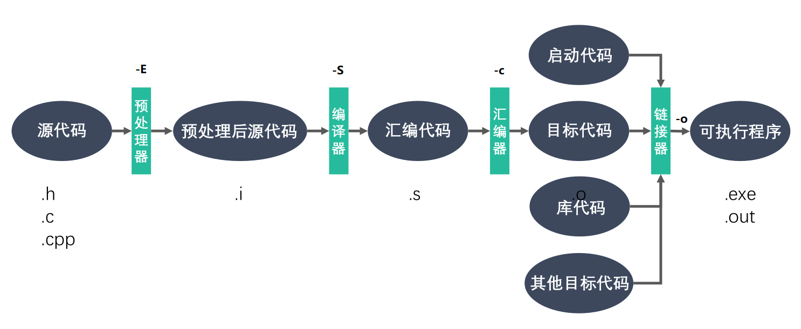

- 预处理的过程包括：头文件展开、宏替换、删除注释等。


#### 1.2.3 gcc 和 g++ 的区别

| 编译器如何处理 | gcc       | g++    |
| -------------- | --------- | ------ |
| .c 文件        | 按 C 程序 | 按 C++ |
| .cpp 文件      | 按 C++    | 按 C++ |

- `gcc main.cpp -o main -lstdc++` 等价于 `g++ main.cpp -o main` 
- `g++`编译时自动链接了`C++`标准库，内部还是调用的`gcc`
- 习惯上用`gcc` 编译 C 程序，`g++`编译 C++ 程序


#### 1.2.4 GCC 常用参数选项

| GCC 编译选项 | 说明                                |
| ------------ | ----------------------------------- |
| -E           | 预处理指定的源文件，不进行编译      |
| -S           | 编译指定的源文件，不进行汇编        |
| -c           | 汇编指定的源文件，不进行链接        |
| -o           | 将一至多个源文件链接成可执行文件    |
| -I [大写 i]  | 指定 include 包含文件的搜索目录     |
| -l [library] | 在程序编译的时候，指定使用的库      |
| -L           | 指定编译时搜索库的路径              |
| -fpic/fPIC   | 生成与位置无关的代码（lib*.so）     |
| -std         | 如:-std=c99，gcc默认标准是GNU C     |
| -On          | n范围：0~3，编译器优化选项的4个级别 |
| -Wall        | 生成所有警告信息                    |
| -g           | 在编译的时候，生成调试信息          |
| -D           | 在程序编译的时候，指定一个宏        |
| -w           | 不生成任何警告信息                  |


### 1.3 静态库和动态库

#### 1.3.1 什么是库

- 库可以提供给使用者一些需要的变量、函数或类
- 库文件有两种，静态库和动态库（共享库）
- 静态库在程序的链接阶段被复制到了程序中
- 动态库在程序运行时由系统动态加载到内存中被调用
- 好处：1. 代码保密  2. 方便部署和分发


#### 1.3.2 静态库的制作

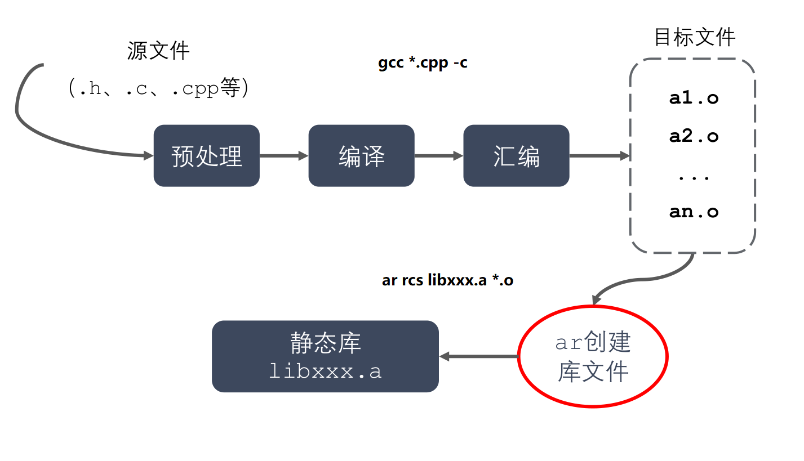

- 命名：

  Linux:  libxxx.a

  Windows: libxxx.lib

- 制作

    ```bash
    # 获得 .o 文件
    gcc  *.c  -c
    
    # 打包 .o 文件
    ar  rcs  libxxx.a  *.o
    
    # 链接 xxx库
    gcc  *.c  -o  main  -lxxx
    
    # 执行
    ./main
    ```


#### 1.3.3 动态库的制作

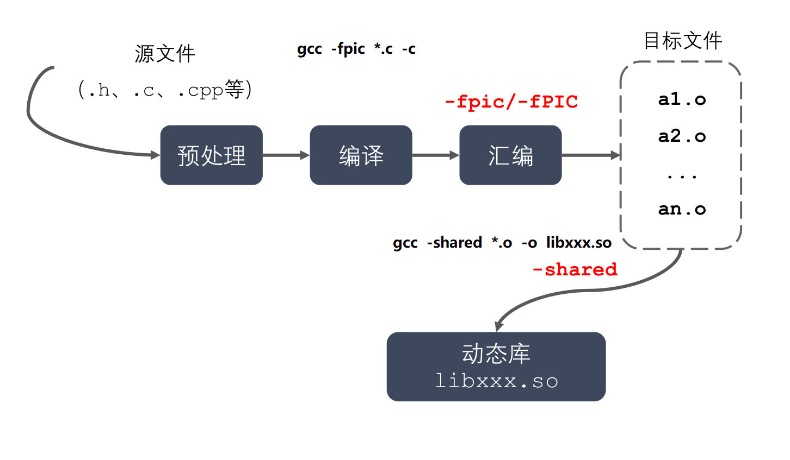

- 命名

  Linux:  libxxx.so

  Windows: libxxx.dll

- 制作

  ```bash
  # 获得和位置无关的 .o 文件
  gcc  -c  -fpic  *.c 
  
  # 获得 .so 动态库
  gcc  -shared  *.o -o libxxx.so
  
  # 链接 XXX库
  gcc  *.c  -o  main  -lxxx
  
  # 执行前需要指定共享库路径，步骤：
  ## ldd(list dynamic dependencies)查看动态库依赖关系
  ldd main
  
  ## 将缺少的库加入环境变量 LD_LIBRARY_PATH
  export LD_LIBRARY_PATH = /xxx/path:$LD_LIBRARY_PATH
  
  # 执行
  ./main
  ```

- 如何定位共享库文件呢？

  > 当系统加载可执行代码时候，能够知道其所依赖的库的名字，但是还需要知道绝对路径。此时就需要系统的动态载入器来获取该绝对路径。对于elf格式的可执行程序，是由ld-linux.so来完成的，它先后搜索elf文件的 DT_RPATH段 ——> 环境变量LD_LIBRARY_PATH ——> /etc/ld.so.cache文件列表 ——> /lib/，/usr/lib目录找到库文件后将其载入内存。


#### 1.3.4 优缺点

| 对比   | 优点                                   | 缺点                                       |
| ------ | -------------------------------------- | ------------------------------------------ |
| 静态库 | 加载速度快；移植方便（无需提供静态库） | 消耗系统资源（内存）；更新、部署、发布麻烦 |
| 动态库 | 进程间资源共享；更新、部署、发布简单   | 加载速度慢；移植需提供动态库               |

- 当两个程序运行同时需要同一库时，静态库会在内存中加载两次，动态库只加载一次。


### 1.4 Makefile

> **作用**：实现“自动化编译” , 只需要一个 `make` 命令，整个工程完全自动编译，提高了软件开发的效率。

#### 1.4.1 规则

- **文件命名**： `makefile` 或者 `Makefile` 

- `Makefile` 规则

  - ```makefile
    target ...: depend ...
    	shell command
    	...
    ```

  - 一个 `Makefile` 文件有一条或者多条规则

  - `Makefile` 中的其它规则一般都是为第一条规则服务的


#### 1.4.2 工作原理

- 命令在执行之前，需要先检查规则中的依赖是否存在
  - 如果存在，执行命令
  - 如果不存在，向下检查其它的规则，检查有没有一个规则是用来生成这个依赖的，如果找到了，则执行该规则中的命令
- 检测更新，在执行规则中的命令时，会比较目标和依赖文件的时间
  - 如果依赖的时间比目标的时间晚，需要重新生成目标
  - 如果依赖的时间比目标的时间早，目标不需要更新，对应规则中的命令不需要被执行

#### 1.4.3 变量

- 自定义变量

  变量名=变量值，eg. `var=hello`

- 预定义变量

  > 只能在规则的命令中使用

  | 变量名 | 变量值                          |
  | ------ | ------------------------------- |
  | AR     | 归档维护程序的名称，默认值为 ar |
  | CC     | C 编译器的名称，默认值为 cc     |
  | CXX    | C++ 编译器的名称，默认值为 g++  |
  | $@     | 规则中目标文件的完整名称        |
  | $<     | 规则中第一个依赖文件的名称      |
  | $^     | 规则中所有的依赖文件            |

- 获取变量名，`$(变量名)`


#### 1.4.4 匹配和函数

- `$` 通配符

  ```makefile
  # %: 通配符，匹配同一个字符串
  # 以下命令相当于：gcc -c *.o, 对每个.o文件编译生成对应.o文件
  %.o:%.c
  	gcc -c $< -o $@
  ```

- `wildcard` 、`patsubst` 函数

  ```makefile
  $(wildcard PATTERN...)
  # 功能： 获取指定目录下指定类型的文件列表
  # 实例： $(wildcard *.c ./sub/*.c), 返回所有一空格间隔的 .c文件列表
  
  $(patsubst <pattern>,<replacement>,<text>)
  # 功能： 将符合<pattern>模式的<text>替换为<replacement>
  # 实例： $(patsubst %.c, %.o, bar.c) 返回 bar.c
  ```

#### 1.4.5 clean

- `make clean` 命令

  ```makefile
  # 指定伪目标，不需要生成 clean 文件
  .PHONY: clean
  clean:
  	rm *.o -r
  ```

### 1.5 GDB 调试

##### 1.5.1 什么是GDB

GDB 是由 GNU 软件系统社区提供的调试工具，同 GCC 配套组成了一套完整的开发环境，GDB 是 Linux 和许多类 Unix 系统中的标准开发环境。

GDB的四个主要功能：

- 启动程序，可以按照自定义的要求运行程序
- 被调试的程序在所指定的断点处停住（断点可以是**条件表达式**）
- 当程序被停住时，可以检查此时程序中所发生的事
- 改变程序，**将一个 BUG 产生的影响修正**从而测试其他 BUG


##### 1.5.2 准备工作

- 生成可执行文件

  ```bash
  # '-O0':编译器优化设为0
  # '-g': 可执行文件加入源码信息
  # '-Wall': warning all
  gcc -g -O0 -Wall main.c -o main
  ```

- 启动调试

  ```bash
  gdb main
  ```

##### 1.5.3 GDB 常用命令

| 功能           | 命令                                                   | 功能               | 命令                                           |
| -------------- | ------------------------------------------------------ | ------------------ | ---------------------------------------------- |
| 退出           | quit                                                   | 帮助               | help                                           |
| 查看主文件代码 | l/ list 行号<br>l/ list 函数名                         | 查看其它文件代码   | l/ list 文件名:行号<br>l/ list 文件名:函数名   |
| 设置/获取参数  | set args 10 20<br>show args                            | 显示/设置行数      | show list/ listsize<br>set list/ listsize      |
| 设置主文件断点 | b/ break 行号<br>b/ break函数名                        | 设置其他文件断点   | b/ break 文件名: 行号<br>b/ break 文件名: 函数 |
| 查看断点       | i/ info  b/ break                                      | 删除断点           | d/ del/ delete  断点编号                       |
| 设置断点无效   | dis/ disable 断点编号                                  | 设置断点生效       | ena/ enable  断点编号                          |
| 设置条件断点   | b/ break 10 if  i==5                                   | 执行至下一个断点前 | c/ continue                                    |
| 运行GDB程序    | start (停在第一行)<br>run (遇到断点停)                 | 打印变量[类型]     | p/ print  变量名<br>ptype 变量名               |
| 向下执行一行   | n/ next<br>不进入函数体                                | 向下单步调试       | s/ step<br>finish (跳出函数体)                 |
| 自动变量操作   | display  变量名<br>i/ info  display<br>undisplay  编号 | 其它操作           | set  var 变量名=变量值<br>until  (跳出循环)    |

##### 1.5.4 GDB 多进程调试

> 使用 GDB 调试的时候，GDB 默认只能跟踪一个进程，可以在 fork 函数调用之前，通过指令设置 GDB 调试工具跟踪父进程或者是跟踪子进程，默认跟踪父进程。
>
> 1. 设置调试父进程或者子进程：`set follow-fork-mode [parent| child]`
>
> 2. 设置调试模式：`set detach-on-fork [on | off]`
>
>    默认为 on，表示调试当前进程的时候，其它的进程继续运行，如果为 off，调试当前进程的时候，其它进程被 GDB 挂起。
>
> 3. 查看调试的进程：`info inferiors`
> 4. 切换当前调试的进程：`inferior id`
> 5. 使进程脱离 GDB 调试：`detach inferiors id`


### 1.6 IO函数 (C库 VS Linux系统)

#### 1.6.1 标准 C 库 IO 函数

> `man 3 fread` 查看函数用法

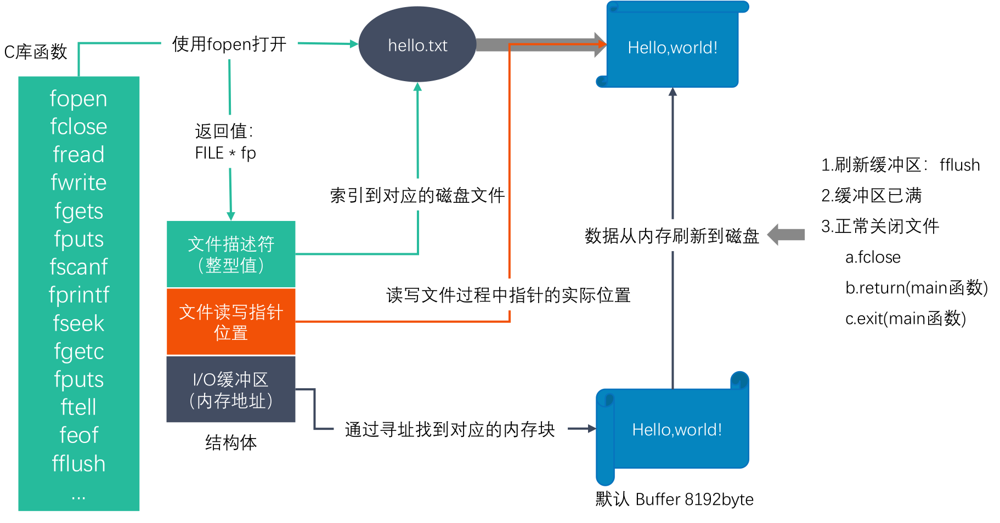

#### 1.6.2 标准 C 库 IO 和 Linux 系统 IO 的关系

> C 库 IO 调用 Linux 系统 IO, 如 fopen标准库函数调用open系统调用

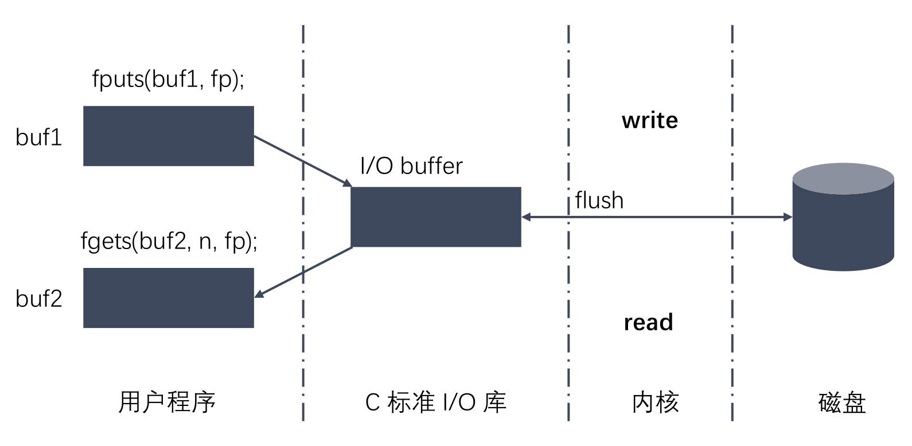

#### 1.6.3 相关概念

1. **虚拟地址空间**

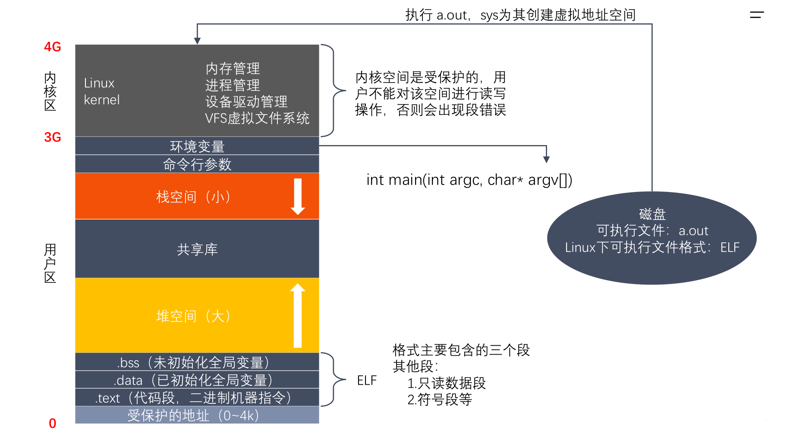

2. **文件描述符**

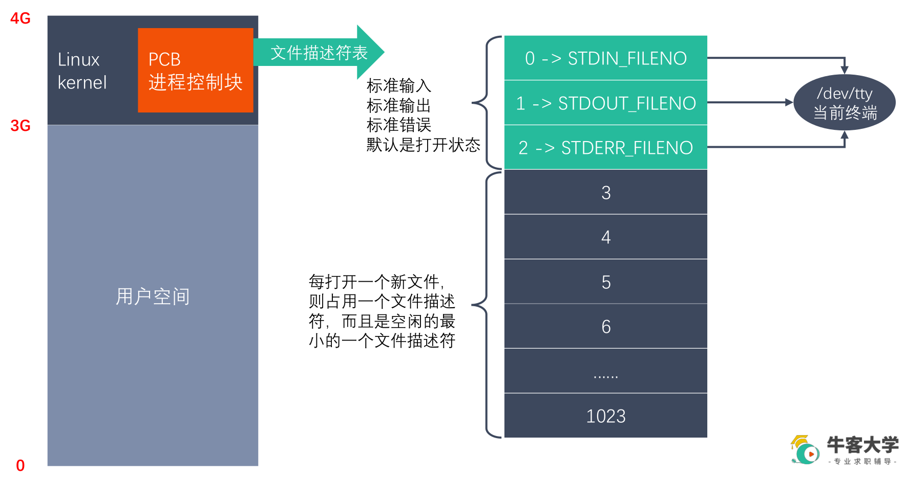

3. **st_mode 变量**

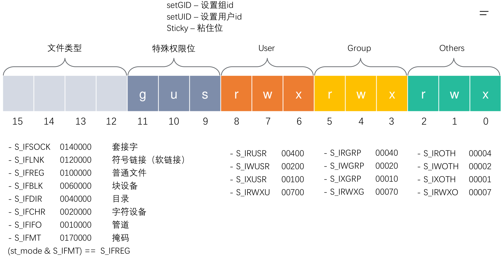

4. **Linux 下文件类型有哪些?**

| 文件类型 | 文件类型标识 | d_type     |
| -------- | ------------ | ---------- |
| 普通文件 | -            | DT_REG     |
| 目录文件 | d            | DT_DIR     |
| 符号链接 | l            | DT_LNK     |
| 字符设备 | c            | DT_CHR     |
| 块设备   | b            | DT_BLK     |
| 管道     | p            | DT_FIFO    |
| 套接字   | s            | DT_SOCK    |
| 未知     |              | DT_UNKNOWN |


#### 1.6.4 Linux 系统 IO 操作

`man 2 open` 查看open函数帮助

1. open/ close

   ```c
   #include <sys/types.h>
   #include <sys/stat.h>
   #include <fcntl.h>
   
   // 打开一个已经存在的文件
   int open(const char *pathname, int flags);
   /*
   参数：
       - pathname：要打开的文件路径
       - flags：对文件的操作权限设置还有其他的设置
         O_RDONLY,  O_WRONLY,  O_RDWR  这三个设置是互斥的
   返回值：返回一个新的文件描述符，如果调用失败，返回-1
   
   errno：属于Linux系统函数库，库里面的一个全局变量，记录的是最近的错误号。
   */
   
   #include <stdio.h>
   void perror(const char *s);
   /*
   作用：打印errno对应的错误描述
   s参数：用户描述，比如hello,最终输出的内容是  hello:xxx(实际的错误描述)
   */  
   
   // 创建一个新的文件
   int open(const char *pathname, int flags, mode_t mode);
   /* 
   参数：
       - pathname：要创建的文件的路径
       - flags：对文件的操作权限和其他的设置
       - 必选项：O_RDONLY,  O_WRONLY, O_RDWR  这三个之间是互斥的
       - 可选项：O_CREAT 文件不存在，创建新文件
       - mode：八进制的数，表示创建出的新的文件的操作权限，比如：0775
       最终的权限是：mode & ~umask
       0777   ->   111111111
       &   0775   ->   111111101
       ----------------------------
       111111101
       按位与：0和任何数都为0
       umask的作用就是抹去某些权限。
   
       flags参数是一个int类型的数据，占4个字节，32位。
       flags 32个位，每一位就是一个标志位。
   */
   
   // 关闭一个文件描述符
   #include <unistd.h>
   int close(int fd);
   
   ```

2. read/ write

   ```C
   #include <unistd.h>
   ssize_t read(int fd, void *buf, size_t count);
   /*
       参数：
           - fd：文件描述符，open得到的，通过这个文件描述符操作某个文件
           - buf：需要读取数据存放的地方，数组的地址（传出参数）
           - count：指定的数组的大小
       返回值：
           - 成功：
               >0: 返回实际的读取到的字节数
               =0：文件已经读取完了
           - 失败：-1 ，并且设置errno
   */
   
   #include <unistd.h>
   ssize_t write(int fd, const void *buf, size_t count);
   /*
       参数：
           - fd：文件描述符，open得到的，通过这个文件描述符操作某个文件
           - buf：要往磁盘写入的数据，数据
           - count：要写的数据的实际的大小
       返回值：
           成功：实际写入的字节数
           失败：返回-1，并设置errno
   */
   ```

3. lseek

   ```C
   // 标准C库的函数
   #include <stdio.h>
   int fseek(FILE *stream, long offset, int whence);
   
   // Linux系统函数
   #include <sys/types.h>
   #include <unistd.h>
   off_t lseek(int fd, off_t offset, int whence);
   /*
       参数：
           - fd：文件描述符，通过open得到的，通过这个fd操作某个文件
           - offset：偏移量
           - whence:
               SEEK_SET
                   设置文件指针的偏移量
               SEEK_CUR
                   设置偏移量：当前位置 + 第二个参数offset的值
               SEEK_END
                   设置偏移量：文件大小 + 第二个参数offset的值
       返回值：返回文件指针的位置
   
   作用：
       1.移动文件指针到文件头
       lseek(fd, 0, SEEK_SET);
   
       2.获取当前文件指针的位置
       lseek(fd, 0, SEEK_CUR);
   
       3.获取文件长度
       lseek(fd, 0, SEEK_END);
   
       4.拓展文件的长度，当前文件10b, 110b, 增加了100个字节
       lseek(fd, 100, SEEK_END)
       注意：需要写一次数据
   */
   ```

4. stat/ lstat

   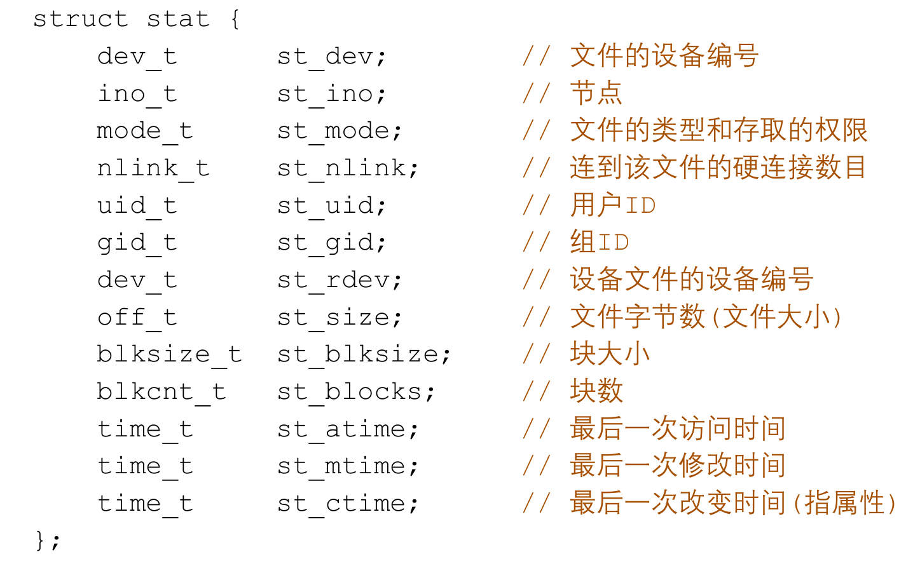

   ```C
   #include <sys/types.h>
   #include <sys/stat.h>
   #include <unistd.h>
   
   int stat(const char *pathname, struct stat *statbuf);
   /*
       作用：获取一个文件相关的一些信息
       参数:
           - pathname：操作的文件的路径
           - statbuf：结构体变量，传出参数，用于保存获取到的文件的信息
       返回值：
           成功：返回0
           失败：返回-1 设置errno
   */
   
   int lstat(const char *pathname, struct stat *statbuf);
   /*
   	作用：获取一个符号链接相关的一些信息
   	参数:
           - pathname：操作的文件的路径
           - statbuf：结构体变量，传出参数，用于保存获取到的文件的信息
       返回值：
           成功：返回0
           失败：返回-1 设置errno
   */
   ```

5. 文件属性操作函数

   ```C
   //文件属性操作函数
   
   #include <unistd.h>
   int access(const char *pathname, int mode);
   /*
       作用：判断某个文件是否有某个权限，或者判断文件是否存在
       参数：
           - pathname: 判断的文件路径
           - mode:
               R_OK: 判断是否有读权限
               W_OK: 判断是否有写权限
               X_OK: 判断是否有执行权限
               F_OK: 判断文件是否存在
       返回值：成功返回0， 失败返回-1
   */
   
   #include <sys/stat.h>
   int chmod(const char *pathname, mode_t mode);
   /*
       修改文件的权限
       参数：
           - pathname: 需要修改的文件的路径
           - mode:需要修改的权限值，八进制的数
       返回值：成功返回0，失败返回-1
   */
   
   #include <unistd.h>
   #include <sys/types.h>
   int truncate(const char *path, off_t length);
   /*
       作用：缩减或者扩展文件的尺寸至指定的大小
       参数：
           - path: 需要修改的文件的路径
           - length: 需要最终文件变成的大小
       返回值：
           成功返回0， 失败返回-1
   */
   
   #include <unistd.h>
   int chown(const char *pathname, uid_t owner, gid_t group);
   /*
   	作用：修改文件的所有者id和组id
   */
   ```

   

6. 目录操作函数

   ```C
   #include <stdio.h>
   int rename(const char *oldpath, const char *newpath);
   
   #include <sys/stat.h>
   #include <sys/types.h>
   int mkdir(const char *pathname, mode_t mode);
   /*
       作用：创建一个目录
       参数：
           pathname: 创建的目录的路径
           mode: 权限，八进制的数
       返回值：
           成功返回0， 失败返回-1
   */
   
   #include <unistd.h>
   int chdir(const char *path);
   /*
       作用：修改进程的工作目录
           比如在/home/nowcoder 启动了一个可执行程序a.out, 进程的工作目录 /home/nowcoder
       参数：
           path : 需要修改的工作目录
   */
   
   #include <unistd.h>
   char *getcwd(char *buf, size_t size);
   /*
       作用：获取当前工作目录
       参数：
           - buf : 存储的路径，指向的是一个数组（传出参数）
           - size: 数组的大小
       返回值：
           返回的指向的一块内存，这个数据就是第一个参数
   */
   
   #include <unistd.h>
   int rmdir(const char *pathname);
   /*
   	作用：删除空目录
   	返回值：
   		成功返回0， 失败返回-1
   ```

   

7. 遍历目录

   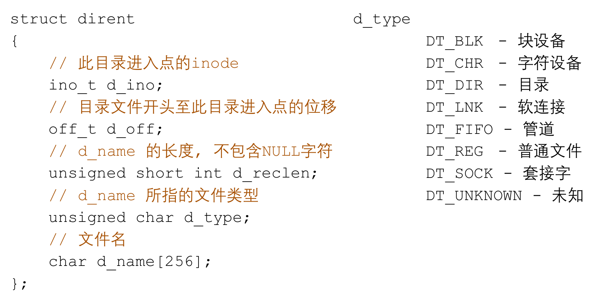

   ```C
   // 打开一个目录
   #include <sys/types.h>
   #include <dirent.h>
   DIR *opendir(const char *name);
   /*
       参数：
           - name: 需要打开的目录的名称
       返回值：
           DIR * 类型，理解为目录流
           错误返回NULL
   */
   
   // 读取目录中的数据
   #include <dirent.h>
   struct dirent *readdir(DIR *dirp);
   /*
       - 参数：dirp是opendir返回的结果
       - 返回值：
           struct dirent，代表读取到的文件的信息
           读取到了末尾或者失败了，返回NULL
   */
   
   // 关闭目录
   #include <sys/types.h>
   #include <dirent.h>
   int closedir(DIR *dirp);
   ```

8. dup/ dup2/ fcntl

   ```C
   #include <unistd.h>
   int dup(int oldfd);
   /*
       作用：复制一个新的文件描述符
       fd=3, int fd1 = dup(fd),
       fd指向的是a.txt, fd1也是指向a.txt
       从空闲的文件描述符表中找一个最小的，作为新的拷贝的文件描述符
   */
   
   
   #include <unistd.h>
   int dup2(int oldfd, int newfd);
   /*
       作用：重定向文件描述符
       oldfd 指向 a.txt, newfd 指向 b.txt
       调用函数成功后：newfd 和 b.txt 做close, newfd 指向了 a.txt
       oldfd 必须是一个有效的文件描述符
       oldfd和newfd值相同，相当于什么都没有做
   */
   
   
   #include <unistd.h>
   #include <fcntl.h>
   int fcntl(int fd, int cmd, ...);
   /*
   参数：
       fd : 表示需要操作的文件描述符
       cmd: 表示对文件描述符进行如何操作
           - F_DUPFD : 复制文件描述符,复制的是第一个参数fd，得到一个新的文件描述符（返回值）
               int ret = fcntl(fd, F_DUPFD);
   
           - F_GETFL : 获取指定的文件描述符文件状态flag
               获取的flag和我们通过open函数传递的flag是一个东西。
   
           - F_SETFL : 设置文件描述符文件状态flag
               必选项：O_RDONLY, O_WRONLY, O_RDWR 不可以被修改
               可选性：O_APPEND, O)NONBLOCK
               O_APPEND 表示追加数据
               NONBLOK 设置成非阻塞
       
       阻塞和非阻塞：描述的是函数调用的行为。
   */
   ```


## 二、Linux多进程开发

### 2.1 进程概述

#### 2.1.1 程序和进程

> **程序**是包含一系列信息的文件，这些信息描述了如何在运行时创建一个进程：
>
> - 二进制格式标识：每个程序文件都包含用于描述可执行文件格式的元信息。内核利用此信息来解释文件中的其他信息。（ELF可执行连接格式）
> - 机器语言指令：对程序算法进行编码。
> - 程序入口地址：标识程序开始执行时的起始指令位置。
> - 数据：程序文件包含的变量初始值和程序使用的字面量值（比如字符串）。
> - 符号表及重定位表：描述程序中函数和变量的位置及名称。这些表格有多重用途，其中包括调试和运行时的符号解析（动态链接）。
> - 共享库和动态链接信息：程序文件所包含的一些字段，列出了程序运行时需要使用的共享库，以及加载共享库的动态连接器的路径名。
> - 其他信息：程序文件还包含许多其他信息，用以描述如何创建进程。
>
> **进程**是正在运行的程序的实例。是一个具有一定独立功能的程序关于某个数据集合的一次运行活动。它是操作系统动态执行的基本单元，在传统的操作系统中，进程既是基本的分配单元，也是基本的执行单元。
>
> 可以用一个程序来创建多个进程，进程是由内核定义的抽象实体，并为该实体分配用以执行程序的各项系统资源。从内核的角度看，进程由用户内存空间和一系列内核数据结构组成，其中用户内存空间包含了程序代码及代码所使用的变量，而内核数据结构则用于维护进程状态信息。记录在内核数据结构中的信息包括许多与进程相关的标识号（IDs）、虚拟内存表、打开文件的描述符表、信号传递及处理的有关信息、进程资源使用及限制、当前工作目录和大量的其他信息。


#### 2.1.2 并行和并发

> **单道、多道**程序设计
>
> - 单道程序，即在计算机内存中只允许一个的程序运行，多道程序设计技术是在计算机内存中同时存放几道相互独立的程序。
>
> **时间片**
>
> - 时间片是操作系统分配给每个正在运行的进程微观上的一段 CPU 时间
> - 时间片通常很短（在 Linux 上为 5ms－800ms）
> - 时间片由操作系统内核的调度程序分配给每个进程
>
> 并发和并行
>
> - **并行**(parallel)：指在同一时刻，有多条指令在多个处理器上同时执行
> - **并发**(concurrency)：指在同一时刻只能有一条指令执行，但多个进程指令被快速的轮换执行，使得在宏观上具有多个进程同时执行的效果，但在微观上并不是同时执行的，只是把时间分成若干段，使多个进程快速交替的执行。


#### 2.1.3 进程控制块（PCB）

- 当前工作目录（Current Working Directory）
- umask 掩码
- 文件描述符表，包含很多指向 file 结构体的指针
- 和信号相关的信息
- 用户 id 和组 id
- 会话（Session）和进程组
- 进程可以使用的资源上限（Resource Limit）


#### 2.1.4 进程状态转换

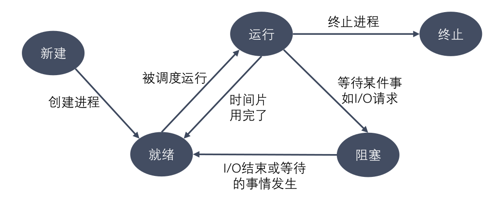

- **运行态**：进程占有处理器正在运行
- **就绪态**：进程具备运行条件，等待系统分配处理器以便运行。当进程已分配到除CPU以外的所有必要资源后，只要再获得CPU，便可立即执行。在一个系统中处于就绪状态的进程可能有多个，通常将它们排成一个队列，称为就绪队列
- **阻塞态**：又称为等待(wait)态或睡眠(sleep)态，指进程不具备运行条件，正在等待某个事件的完成
- 新建态：进程刚被创建时的状态，尚未进入就绪队列
- 终止态：进程完成任务到达正常结束点，或出现无法克服的错误而异常终止，或被操作系统及有终止权的进程所终止时所处的状态。进入终止态的进程以后不再执行，但依然保留在操作系统中等待善后。一旦其他进程完成了对终止态进程的信息抽取之后，操作系统将删除该进程。


### 2.2 进程相关命令

#### 2.2.1 查看进程

```bash
ps -aux
ps -ajx
# a: 显示终端上所有进程，包括其他用户进程
# u: 显示进程的详细信息
# x: 显示没有控制端的进程
# j: 列出与作业控制相关的信息
```

`ps -aux` 查看格式：

| USER | PID  | %CPU | %MEM | VSZ  | RSS  | TTY  | STAT | START | TIME | COMMAND |
| ---- | ---- | ---- | ---- | ---- | ---- | ---- | ---- | ----- | ---- | ------- |
| root | 1    | 0.1  | 0.1  | 0    | 0    | ?    | Ss   | 3月26 | 1:22 | ./main  |

STAT 参数意义：

| D         | 不可中断 Uninterruptible（usually IO |
| --------- | ------------------------------------ |
| R         | 正在运行，或在队列中的进程           |
| S（大写） | 处于休眠状态                         |
| T         | 停止或被追踪                         |
| Z         | 僵尸进程                             |
| W         | 进入内存交换（从内核2.6开始无效      |
| X         | 死掉的进程                           |
| <         | 高优先级                             |
| N         | 低优先级                             |
| s         | 包含子进程                           |
| +         | 位于前台的进程组                     |


#### 2.2.2 动态显示进程

`top` 实时显示进程动态

`top -d 5` : 指定显示信息更新时间间隔为5秒

可按以下键对显示结果进行排序：

| 内存 | CPU  | 运行时长 | 用户名筛选 | 输入PID杀死进程 |
| ---- | ---- | -------- | ---------- | --------------- |
| M    | P    | T        | U          | K               |


#### 2.2.3 杀死进程

```bash
# 列出所有 signal
kill -l

# 根据进程号
kill [-signal] pid
# eg:
kill -9 pid
kill -SIGKILL pid

# 根据进程名
killall name p_name
```


#### 2.2.4 进程号和相关函数

> - 每个进程都由进程号来标识，其类型为 pid_t（整型），进程号的范围：0～32767。进程号总是唯一的，但可以重用。当一个进程终止后，其进程号就可以再次使用。
> - 任何进程（除 init 进程）都是由另一个进程创建，该进程称为被创建进程的父进程，对应的进程号称为父进程号（PPID）。
> - 进程组是一个或多个进程的集合。他们之间相互关联，进程组可以接收同一终端的各种信号，关联的进程有一个进程组号（PGID）。默认情况下，当前的进程号会当做当前的进程组号。

相关系统调用：

```C
// 获取自身进程号
pid_t getpid(void);

// 获取父进程号
pid_t getppid(void);

// 获取进程组号
pid_t get pgid(pid_t pid);
```


### 2.3 进程创建

```C
#include <sys/types.h>
#include <unistd.h>

pid_t fork(void);
/*
        函数的作用：用于创建子进程。
        返回值：
            fork()的返回值会返回两次。一次是在父进程中，一次是在子进程中。
            在父进程中返回创建的子进程的ID,
            在子进程中返回0
            如何区分父进程和子进程：通过fork的返回值。
            在父进程中返回-1，表示创建子进程失败，并且设置errno

        父子进程之间的关系：
        区别：
            1.fork()函数的返回值不同
                父进程中: >0 返回的子进程的ID
                子进程中: =0
            2.pcb中的一些数据
                当前的进程的id pid
                当前的进程的父进程的id ppid
                信号集

        共同点：
            某些状态下：子进程刚被创建出来，还没有执行任何的写数据的操作
                - 用户区的数据
                - 文件描述符表
        
        父子进程对变量是不是共享的？
            - 刚开始的时候，是一样的，共享的。如果修改了数据，不共享了。
            - 读时共享（子进程被创建，两个进程没有做任何的写的操作），写时拷贝。
            - fork之后父子进程共享文件，fork产生的子进程与父进程相同的
              文件文件描述符指向相同的文件表，引用计数增加，共享文件偏移指针。
*/

```


### 2.4 exec 函数族

> exec 函数族的作用是根据指定的文件名找到可执行文件，并用它来取代调用进程的内容，换句话说，就是在调用进程内部执行一个可执行文件。
>
> exec 函数族的函数执行成功后不会返回，因为调用进程的实体，包括代码段，数据段和堆栈等都已经被新的内容取代，只留下进程 ID 等一些表面上的信息仍保持原样。调用失败返回 -1，从原程序的调用点接着往下执行。

```C
#include <unistd.h>
// C库
int execl(const char *pathname, const char *arg, ... /* (char  *) NULL */);
int execlp(const char *file, const char *arg, ... /* (char  *) NULL */);
int execle(const char *pathname, const char *arg, ...
           /*, (char *) NULL, char *const envp[] */);
int execv(const char *pathname, char *const argv[]);
int execvp(const char *file, char *const argv[]);
int execvpe(const char *file, char *const argv[], char *const envp[]);

// 系统调用
int execve(const char *pathname, char *const argv[], char *const envp[]);
```

| l (list)       | 参数地址列表，以空指针结尾               |
| -------------- | ---------------------------------------- |
| v(vector)      | 存有各参数地址的指针数组的地址           |
| p(path)        | 按 PATH 环境变量指定的目录搜索可执行文件 |
| e(environment) | 存有环境变量字符串地址的指针数组的地址   |

### 2.5 进程控制

#### 2.5.1 进程退出

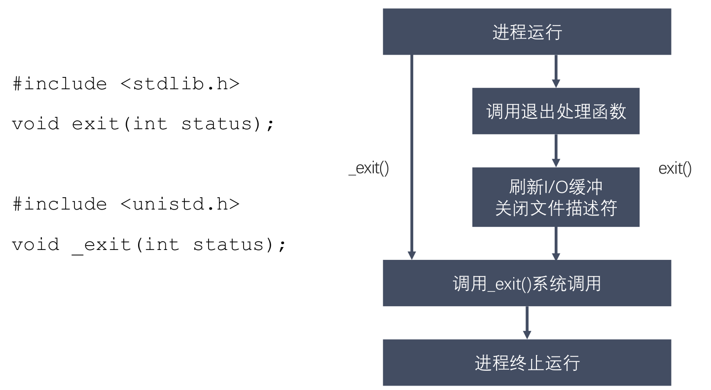

#### 2.5.2 孤儿进程

- 父进程运行结束，但子进程还在运行（未运行结束），这样的子进程就称为孤儿进程（Orphan Process）。
- 每当出现一个孤儿进程的时候，内核就把孤儿进程的父进程设置为 init (pid=1)，而 init 进程会循环地 wait() 它的已经退出的子进程。这样，当一个孤儿进程凄凉地结束了其生命周期的时候，init 进程就会代表党和政府出面处理它的一切善后工作。
- 因此孤儿进程并不会有什么危害。

#### 2.5.3 僵尸进程

- 每个进程结束之后, 都会释放自己地址空间中的用户区数据，内核区的 PCB 没有办法自己释放掉，需要父进程去释放。
- 进程终止时，父进程尚未回收，子进程残留资源（PCB）存放于内核中，变成僵尸（Zombie）进程。
- 僵尸进程不能被 `kill -9` 杀死，如果父进程不调用 `wait()`或 `waitpid()` 的话，那么保留的那段信息就不会释放，其进程号就会一直被占用，但是系统所能使用的进程号是有限的，如果大量的产生僵尸进程，将因为没有可用的进程号而导致系统不能产生新的进程，此即为僵尸进程的危害，应当避免。

#### 2.5.4 进程回收

- 在每个进程退出的时候，内核释放该进程所有的资源、包括打开的文件、占用的内存等。但是仍然为其保留一定的信息，这些信息主要主要指进程控制块PCB的信息（包括进程号、退出状态、运行时间等）
- 父进程可以通过调用`wait`或`waitpid`得到它的退出状态同时彻底清除掉这个进程。
- `wait()` 和 `waitpid()` 函数的功能一样，区别在于，`wait()` 函数会阻塞，`waitpid()` 可以设置不阻塞，`waitpid()` 还可以指定等待哪个子进程结束。
- 一次`wait`或`waitpid`调用只能清理一个子进程，清理多个子进程应使用循环。

```C
#include <sys/types.h>
#include <sys/wait.h>
pid_t wait(int *wstatus);
/*    
    功能：等待任意一个子进程结束，如果任意一个子进程结束了，次函数会回收子进程的资源。
    参数：int *wstatus
        进程退出时的状态信息，传入的是一个int类型的地址，传出参数。
    返回值：
        - 成功：返回被回收的子进程的id
        - 失败：-1 (所有的子进程都结束，调用函数失败)

    调用wait函数的进程会被挂起（阻塞），直到它的一个子进程退出或者收到一个不能被忽略
    的信号时才被唤醒（相当于继续往下执行）。
    如果没有子进程了，函数立刻返回，返回-1；如果子进程都已经结束了，也会立即返回，返回-1.
*/
```

```C
#include <sys/types.h>
#include <sys/wait.h>
pid_t waitpid(pid_t pid, int *wstatus, int options);
/*
    功能：回收指定进程号的子进程，可以设置是否阻塞。
    参数：
        - pid:
            pid > 0 : 某个子进程的pid
            pid = 0 : 回收当前进程组的所有子进程    
            pid = -1 : 回收所有的子进程，相当于 wait()  （最常用）
            pid < -1 : 某个进程组的组id的绝对值，回收指定进程组中的子进程
        - options：设置阻塞或者非阻塞
            0 : 阻塞
            WNOHANG : 非阻塞
        - 返回值：
            > 0 : 返回子进程的id
            = 0 : options=WNOHANG, 表示还有子进程活着         
            = -1 ：错误，或者没有子进程了
*/
```


## 三、Linux多线程开发

### 1. Theory

#### 1.1 一个线程占多大内存？

一个 Linux 的线程大概占 8M 内存。Linux 的栈是通过缺页来分配内存的，不是所有栈地址空间都分配了内存。因此，8M 是最大消耗，实际的内存消耗只会略大于实际需要的内存(内部损耗，每个在 4K 以内)。


#### 1.2 什么是并发和并行?

1. **并发:** 对于单个CPU，在一个时刻只有一个进程在运行，但是线程的切换时间则减少到纳秒数量级，多个任务不停来回快速切换。
2. **并行:** 对于多个CPU，多个进程同时运行。
3. **区别:** 通俗来讲，它们虽然都说是"多个进程同时运行"，但是它们的"同时"不是一个概念。并行的"同时"是同一时刻可以多个任务在运行(处于running)，并发的"同时"是经过不同线程快速切换，使得看上去多个任务同时都在运行的现象。


#### 1.3 说说进程、线程、协程是什么，区别是什么？

1. **进程**：程序是指令、数据及其组织形式的描述，而进程则是程序的运行实例，包括程序计数器、寄存器和变量的当前值。

2. **线程**：微进程，一个进程里更小粒度的执行单元。一个进程里包含多个线程并发执行任务。

3. **协程**：协程是微线程，在子程序内部执行，可在子程序内部中断，转而执行别的子程序，在适当的时候再返回来接着执行。

4. **线程与进程的区别: **

  - 一个线程从属于一个进程；一个进程可以包含多个线程。
  - 一个线程挂掉，对应的进程挂掉；一个进程挂掉，不会影响其他进程。
  - 进程是系统资源调度的最小单位；线程CPU调度的最小单位。
  - 进程系统开销显著大于线程开销；线程需要的系统资源更少。
  - 进程在执行时拥有独立的内存单元，多个线程共享进程的内存，如代码段、数据段、扩展段；但每个线程拥有自己的栈段和寄存器组。
  - 进程切换时需要刷新TLB并获取新的地址空间，然后切换硬件上下文和内核栈，线程切换时只需要切换硬件上下文和内核栈。
  - 通信方式不一样。
  - 进程适应于多核、多机分布；线程适用于多核

5. **线程与协程的区别**：

  - 协程执行效率极高。协程直接操作栈基本没有内核切换的开销，所以上下文的切换非常快，切换开销比线程更小。

  - 协程不需要多线程的锁机制，因为多个协程从属于一个线程，不存在同时写变量冲突，效率比线程高。

  - 一个线程可以有多个协程。


#### 1.4 协程是轻量级线程，轻量级表现在哪里？

1. **协程调用跟切换比线程效率高**：协程执行效率极高。协程不需要多线程的锁机制，可以不加锁的访问全局变量，所以上下文的切换非常快。
2. **协程占用内存少**：执行协程只需要极少的栈内存（大概是4～5KB），而默认情况下，线程栈的大小为1MB。
3. **切换开销更少**：协程直接操作栈基本没有内核切换的开销，所以切换开销比线程少。


#### 1.5 说说线程间通信的方式有哪些？

线程间的通信方式包括**临界区、互斥量、信号量、条件变量、读写锁**：

1. 临界区：每个线程中访问临界资源的那段代码称为临界区（Critical Section）（临界资源是一次仅允许一个线程使用的共享资源）。每次只准许一个线程进入临界区，进入后不允许其他线程进入。不论是硬件临界资源，还是软件临界资源，多个线程必须互斥地对它进行访问。
2. 互斥量：采用互斥对象机制，只有拥有互斥对象的线程才可以访问。因为互斥对象只有一个，所以可以保证公共资源不会被多个线程同时访问。
3. 信号量：计数器，允许多个线程同时访问同一个资源。
4. 条件变量：通过条件变量通知操作的方式来保持多线程同步。
5. 读写锁：读写锁与互斥量类似。但互斥量要么是锁住状态，要么就是不加锁状态。读写锁一次只允许一个线程写，但允许一次多个线程读，这样效率就比互斥锁要高。


#### 1.6 说说线程同步方式有哪些？

线程间的同步方式包括**互斥锁、信号量、条件变量、读写锁**：

1. 互斥锁：采用互斥对象机制，只有拥有互斥对象的线程才可以访问。因为互斥对象只有一个，所以可以保证公共资源不会被多个线程同时访问。
2. 信号量：计数器，允许多个线程同时访问同一个资源。
3. 条件变量：通过条件变量通知操作的方式来保持多线程同步。
4. 读写锁：读写锁与互斥量类似。但互斥量要么是锁住状态，要么就是不加锁状态。读写锁一次只允许一个线程写，但允许一次多个线程读，这样效率就比互斥锁要高。


#### 1.7 说说什么是死锁，产生的条件，如何解决？

1. 死锁: 是指多个进程在执行过程中，因争夺资源而造成了互相等待。此时系统产生了死锁。比如两
   只羊过独木桥，若两只羊互不相让，争着过桥，就产生死锁。
2. 产生的条件：死锁发生有四个必要条件：

  - 互斥条件：进程对所分配到的资源不允许其他进程访问，若其他进程访问，只能等待，直到进程使用完成后释放该资源；
  - 请求保持条件：进程获得一定资源后，又对其他资源发出请求，但该资源被其他进程占有，此时请求阻塞，而且该进程不会释放自己已经占有的资源；
  - 不可剥夺条件：进程已获得的资源，只能自己释放，不可剥夺；
  - 环路等待条件：若干进程之间形成一种头尾相接的循环等待资源关系。

3. 如何解决：
   （1）资源一次性分配，从而解决请求保持的问题
   （2）可剥夺资源：当进程新的资源未得到满足时，释放已有的资源；
   （3）资源有序分配：资源按序号递增，进程请求按递增请求，释放则相反。


#### 1.8 有了进程，为什么还要有线程？

1. **原因**
   进程在早期的多任务操作系统中是基本的**执行单元**。每次进程切换，都要先保存进程资源然后再恢复，这称为上下文切换。**但是进程频繁切换将引起额外开销，从而严重影响系统的性能**。为了减少进程切换的开销，人们把两个任务放到一个进程中，每个任务用一个更小**粒度**的执行单元来实现并发执行，这就是**线程**。
2. **线程与进程对比**

  - **进程间的信息难以共享**。由于除去只读代码段外，父子进程并未共享内存，因此必须采用一
    些进程间通信方式，在进程间进行信息交换。但**多个线程共享**进程的内存，如代码段、数据段、扩展段，线程间进行信息交换十分方便。
  - 调用 fork() 来创建进程的代价相对较高，即便利用写时复制技术，仍然需要复制诸如内存页表和文件描述符表之类的多种进程属性，这意味着 `fork()` 调用在时间上的开销依然不菲。但**创建线程比创建进程通常要快 10 倍甚至更多**。线程间是共享虚拟地址空间的，无需采用写时复制来复制内存，也无需复制页表。

#### 1.9 单核机器上写多线程程序，是否要考虑加锁，为什么？

在单核机器上写多线程程序，仍然需要线程锁。

原因：因为线程锁通常用来实现线程的同步和通信。在单核机器上的多线程程序，仍然存在线程同步的问题。因为在抢占式操作系统中，通常为每个线程分配一个时间片，当某个线程时间片耗尽时，操作系统会将其挂起，然后运行另一个线程。如果这两个线程共享某些数据，**不使用线程锁的前提下，可能会导致共享数据修改引起冲突。**


#### 1.10 说说多线程和多进程的不同？

1. 一个线程从属于一个进程；一个进程可以包含多个线程。
2. 一个线程挂掉，对应的进程挂掉，多线程也挂掉；一个进程挂掉，不会影响其他进程，多进程稳定。
3. 进程系统开销显著大于线程开销；线程需要的系统资源更少。
4. 多个进程在执行时拥有各自独立的内存单元，多个线程共享进程的内存，如代码段、数据段、扩展段；但每个线程拥有自己的栈段和寄存器组。
5. 多进程切换时需要刷新TLB并获取新的地址空间，然后切换硬件上下文和内核栈；多线程切换时只需要切换硬件上下文和内核栈。
6. 通信方式不一样。
7. 多进程适应于多核、多机分布；多线程适用于多核


#### 1.11 进程和线程相比，为什么慢？

1. 进程系统开销显著大于线程开销；线程需要的系统资源更少。
2. 进程切换开销比线程大。多进程切换时需要刷新TLB并获取新的地址空间，然后切换硬件上下文和内核栈；多线程切换时只需要切换硬件上下文和内核栈。
3. 进程通信比线程通信开销大。进程通信需要借助管道、队列、共享内存，需要额外申请空间，通信繁琐；而线程共享进程的内存，如代码段、数据段、扩展段，通信快捷简单，同步开销更小。


#### 1.12 简述互斥锁的机制，互斥锁与读写的区别？

1. **互斥锁机制**：`mutex`，用于保证在任何时刻，都只能有一个线程访问该对象。当获取锁操作失败时，线程会进入睡眠，等待锁释放时被唤醒。
2. **互斥锁和读写锁**：

  - 读写锁区分读者和写者，而互斥锁不区分
  - 互斥锁同一时间只允许一个线程访问该对象，无论读写；读写锁同一时间内只允许一个写者，但是允许多个读者同时读对象。


#### 1.13 说说什么是信号量，有什么作用？

1. **概念**：信号量本质上是一个计数器，用于多进程对共享数据对象的读取，它主要是用来保护共享资源（信号量也属于临界资源），使得资源在一个时刻只有一个进程独享。
2. **原理**：由于信号量只能进行两种操作等待和发送信号，即`P(sv)`和`V(sv)`，具体的行为如下：

  - `P(sv)`操作：如果`sv`的值大于零，就给它减1；如果它的值为零，就挂起该进程的执行（信号量的值为正，进程获得该资源的使用权，进程将信号量减1，表示它使用了一个资源单位）。
  - `V(sv)`操作：如果有其他进程因等待`sv`而被挂起，就让它恢复运行，如果没有进程因等待`sv`而挂起，就给它加1（若此时信号量的值为0，则进程进入挂起状态，直到信号量的值大于0，若进程被唤醒则返回至第一步）。

3. **作用**：用于多进程对共享数据对象的读取，它主要是用来保护共享资源（信号量也属于临界资源），使得资源在一个时刻只有一个进程独享。


#### 1.14 进程、线程的中断切换的过程是怎样的？

上下文切换指的是内核（操作系统的核心）在CPU上对进程或者线程进行切换。

1. **进程上下文切换**
   （1）保护被中断进程的处理器现场信息
   （2）修改被中断进程的进程控制块有关信息，如进程状态等
   （3）把被中断进程的进程控制块加入有关队列
   （4）选择下一个占有处理器运行的进程
   （5）根据被选中进程设置操作系统用到的地址转换和存储保护信息**切换页目录以使用新的地址空间切换内核栈和硬件上下文（包括分配的内存，数据段，堆栈段等）**
   （6）根据被选中进程恢复处理器现场
2. 线程上下文切换
   （1）保护被中断线程的处理器现场信息
   （2）修改被中断线程的线程控制块有关信息，如线程状态等
   （3）把被中断线程的线程控制块加入有关队列
   （4）选择下一个占有处理器运行的线程
   （5）根据被选中线程设置操作系统用到的存储保护信息**切换内核栈和硬件上下文（切换堆栈，以及各寄存器）**
   （6）根据被选中线程恢复处理器现场


#### 1.15 简述自旋锁和互斥锁的使用场景

1. **互斥锁**用于临界区持锁时间比较长的操作，比如下面这些情况都可以考虑
   （1）临界区有 IO 操作
   （2）临界区代码复杂或者循环量大
   （3）临界区竞争非常激烈
   （4）单核处理器
2. **自旋锁**就主要用在临界区持锁时间非常短且CPU资源不紧张的情况下。


#### 1.16 为什么要创建线程池? 线程池的设计思路？

1. **为什么要创建线程池:**
   创建线程和销毁线程的花销是比较大的，这些时间有可能比处理业务的时间还要长。这样频繁的创建线程和销毁线程，再加上业务工作线程，消耗系统资源的时间，可能导致系统资源不足。同时线程池也是为了提升系统效率。

2. **设计思路**：
   实现线程池有以下几个步骤：
   （1）设置一个生产者消费者队列，作为临界资源。
   （2）初始化n个线程，并让其运行起来，加锁去队列里取任务运行
   （3）当任务队列为空时，所有线程阻塞。
   （4）当生产者队列来了一个任务后，先对队列加锁，把任务挂到队列上，然后使用条件变量去通知阻塞中的一个线程来处理。

3. **线程池中线程数量**：
   线程数量和哪些因素有关：CPU，IO、并行、并发:

  ```
如果是CPU密集型应用，则线程池大小设置为：CPU数目+1
如果是IO密集型应用，则线程池大小设置为：2*CPU数目+1
最佳线程数目 = （线程等待时间与线程CPU时间之比 + 1）* CPU数目
  ```

  所以线程等待时间所占比例越高，需要越多线程。线程CPU时间所占比例越高，需要越少线程。


2. **线程池的核心线程与普通线程：**
   任务队列可以存放100个任务，此时为空，线程池里有10个核心线程，若突然来了10个任务，那么刚好10个核心线程直接处理；若又来了90个任务，此时核心线程来不及处理，那么有80个任务先入队列，再创建核心线程处理任务；若又来了120个任务，此时任务队列已满，不得已，就得创建20个普通线程来处理多余的任务。以上是线程池的工作流程。


 

### 2. Practice

`pthread.h`函数说明参考地址：https://pubs.opengroup.org/onlinepubs/007908799/xsh/pthread.h.html

#### 2.1 线程操作

| 功能                         | 函数             |
| ---------------------------- | ---------------- |
| **创建一个新线程**           | `pthread_create` |
| **获得调用线程的**ID         | `pthread_self`   |
| **比较线程**ID               | `pthread_equal`  |
| **终止当前线程**             | `pthread_exit`   |
| **等待线程结束并回收其资源** | `pthread_join`   |
| **分离一个线程**             | `pthread_detach` |
| **向一个线程发送取消请求**   | `pthread_cancel` |


- 创建一个新线程

  `int pthread_create(pthread_t *thread, const pthread_attr_t *attr, void *(*start_routine) (void *), void *arg);`

  ```
  - 功能：创建一个具有指定参数的子线程
  - 头文件: #include <pthread.h>
  - 参数：
      - thread：传出参数，创建线程的 id 指针
      - attr : 设置线程的属性，一般使用默认值，NULL
      - start_routine : 参数和返回值是 void 类型的指针函数
      - arg : start_routine的实参
  - 返回值：
      成功：0
      失败：返回错误号,和errno不太一样。
      获取错误号信息：  char * strerror(int errnum);
  ```

- 终止一个线程

  `void pthread_exit(void *retval);`

  ```
  - 功能：终止一个线程，在哪个线程中调用，就表示终止哪个线程
  - 头文件: #include <pthread.h>
  - 参数:
  	- retval:需要传递一个指针，作为一个返回值，可以在 pthread_join()中获取
  - 返回值: void
  ```

- 获得调用线程的ID

  `pthread_t pthread_self(void);`

  ```
  - 功能: 获得调用线程的ID
  - 头文件: #include <pthread.h>
  - 参数: void
  - 返回值: pthread_t(线程id指针)
  ```

- 比较线程ID

  `int pthread_equal(pthread_t t1, pthread_t t2);`

  ```
  - 功能：比较两个线程ID是否相等
  - 头文件: #include <pthread.h>
  - 参数: 
  	- t1: 线程id
  	- t2: 线程id
  - 返回值: t1和t2相等返回非零,否则返回0
  ```

- 等待线程结束

  `int pthread_join(pthread_t thread, void **retval);`

  ```
  - 功能：这个函数是一个线程阻塞的函数，调用它的函数将一直等待到被
  	   等待的线程结束为止，当函数返回时，被等待线程的资源被收回.
  - 头文件: #include <pthread.h>
  - 参数:
  	- thread: 被等待的子线程ID
  	- retval: 一个用户定义的指针，它可以用来存储被等待子线程的返回值
  - 返回值:
  	成功返回0,否则返回错误的编号
  ```

- 分离一个线程

  `int pthread_detach(pthread_t thread);`

  ```
  - 功能: 线程资源释放方式设置函数. 
  	- 分离一个线程, 被分离的线程在终止的时候，会自动释放资源返回给系统。
  	- 不能多次分离，会产生不可预料的行为。
  	- 不能去连接一个已经分离的线程，会报错。
  	
  - 头文件: #include <pthread.h>
  - 参数：需要分离的线程的ID
  - 返回值：
      成功：0
      失败：返回错误号
  ```

- **线程取消函数**

  `int pthread_cancel(pthread_t thread);`

  ```
  - 头文件：#include <pthread.h>
  - 功能：取消线程（让线程终止）
  	- 取消某个线程，可以终止某个线程的运行，并不是立马终止，而是当子线程执行到一个取消点，线程才会终止。
      - 取消点：系统规定好的一些系统调用，我们可以粗略的理解为从用户区到内核区的切换，这个位置称之为取消点。
  - 参数：
  	- thread: 要取消线程ID
  - 返回值：
  	- 成功返回0
  	- 失败返回错误的编号
  ```


#### 2.2 线程属性

| 功能                                 | 函数                          |
| ------------------------------------ | ----------------------------- |
| **初始化线程属性对象**               | `pthread_attr_init`           |
| **销毁线程属性对象**                 | `pthread_attr_destroy`        |
| **在线程属性对象中设置分离状态属性** | `pthread_attr_getdetachstate` |
| **获取线程属性对象中的分离状态属性** | `pthread_attr_setdetachstate` |

- 初始化线程属性对象

  `int pthread_attr_init(pthread_attr_t *attr);`

  ```
  头文件：#include <pthread.h>
  说明：pthread_attr_init 实现时为属性对象分配了动态内存空间
       Posix 线程中的线程属性 pthread_attr_t主要包括scope属性、detach属性、堆栈地址、堆栈大小、优先级
  形参：
      attr: 指向一个线程属性的指针
  
  返回值：若是成功返回0,否则返回错误的编号
  ```

  

- 销毁线程属性对象

  `int pthread_attr_destroy(pthread_attr_t *attr);`

  ```
  头文件：#include <pthread.h>
  说明：经 pthread_attr_destroy 去除初始化之后的 pthread_attr_t 结构被 pthread_create 函数调用，将会导致其返回错误
  
  形参：
      attr: 指向一个线程属性的指针
  
  返回值：若是成功返回0,否则返回错误的编号
  ```

  

- 在线程属性对象中设置分离状态属性

  `int pthread_attr_setdetachstate(pthread_attr_t *attr, int detachstate);`

  ```
  头文件：#include <pthread.h>
  说明：修改线程分离状态属性；pthread_detach()分离释放线程资源函数
  
  形参：
      attr: 指向一个线程属性的指针
      detachstate: 有两个取值
  		- PTHREAD_CREATE_JOINABLE（可连接），使用attr创建的所有线程处于可连接状态，线程终止不会回收相关资源，需在其他线程调用pthread_detach()或pthread_join()函数
  		- PTHREAD_CREATE_DETACHED(分离)，使用attr创建的所有线程处于分离状态，这类线程终止带有此状态的线程相关资源将被系统收回
  
  返回值：若是成功返回0,否则返回错误的编号
  ```

  

- 获取线程属性对象中的分离状态属性

  `int pthread_attr_getdetachstate(const pthread_attr_t *attr, int *detachstate);`

  ```
  头文件：#include <pthread.h>
  说明：获取线程分离状态属性；pthread_detach()分离释放线程资源函数
  
  形参：
      attr          指向一个线程属性的指针
      detachstate   保存返回的分离状态属性
  
  返回值：若是成功返回0,否则返回错误的编号
  ```

  

#### 2.3 互斥量

| 功能           | 函数                    |
| -------------- | ----------------------- |
| **初始化**     | `pthread_mutex_init`    |
| **销毁**       | `pthread_mutex_destory` |
| **阻塞加锁**   | `pthread_mutex_lock`    |
| **非阻塞加锁** | `pthread_mutex_trylock` |
| **解锁**       | `pthread_mutex_unlock`  |

- 初始化互斥锁

  `int pthread_mutex_init(pthread_mutex_t *restrict mutex, const pthread_mutexattr_t *restrict attr);`

  ```
  头文件：#include <pthread.h>
  参数：
  	mutex: 需要初始化的互斥量
  	attr: 互斥量的相关属性，NULL
  修饰符：
  	restrict: 修饰的指针，不能由另外的一个指针进行操作
  		pthread_mutex_t *restrict mutex = xxx;
          pthread_mutex_t * mutex1 = mutex;
  ```

  

- 销毁互斥锁

  `int pthread_mutex_destroy(pthread_mutex_t *mutex);`

- 阻塞方式加锁

  `int pthread_mutex_lock(pthread_mutex_t *mutex);`

- 非阻塞方式加锁

  `int pthread_mutex_trylock(pthread_mutex_t *mutex);`

- 解锁

  `int pthread_mutex_unlock(pthread_mutex_t *mutex);`

  

#### 2.4 读写锁

`pthread_rwlock_t`  0 至 n 个读线程或 0 至 1 个写线程获得锁

| 功能               | 函数                       |
| ------------------ | -------------------------- |
| **初始化**         | `pthread_rwlock_init`      |
| **销毁**           | `pthread_rwlock_destroy`   |
| **加读锁、阻塞**   | `pthread_rwlock_rdlock`    |
| **加读锁、非阻塞** | `pthread_rwlock_tryrdlock` |
| **加写锁、阻塞**   | `pthread_rwlock_wrlock`    |
| **加写锁、非阻塞** | `pthread_rwlock_trywrlock` |
| **解锁**           | `pthread_rwlock_unlock`    |

- `int pthread_rwlock_init(pthread_rwlock_t *restrict rwlock, const pthread_rwlockattr_t *restrict attr);`
- `int pthread_rwlock_destroy(pthread_rwlock_t *rwlock);`
- `int pthread_rwlock_rdlock(pthread_rwlock_t *rwlock);`
- `int pthread_rwlock_tryrdlock(pthread_rwlock_t *rwlock);`
- `int pthread_rwlock_wrlock(pthread_rwlock_t *rwlock);`
- `int pthread_rwlock_trywrlock(pthread_rwlock_t *rwlock);`
- `int pthread_rwlock_unlock(pthread_rwlock_t *rwlock);`


#### 2.5 条件变量

与互斥锁不同，**条件变量是用来等待而不是用来上锁的。条件变量用来自动阻塞一个线程，直到某特殊情况发生为止**。**通常条件变量和互斥锁同时使用。**

| 功能             | 函数                     |
| ---------------- | ------------------------ |
| **初始化**       | `pthread_cond_init`      |
| **销毁**         | `pthread_cond_destroy`   |
| **阻塞等待条件** | `pthread_cond_wait`      |
| **超时等待条件** | `pthread_cond_timedwait` |
| **通知条件**     | `pthread_cond_signal`    |
| **广播通知条件** | `pthread_cond_broadcast` |

- 初始化

  ```
  #include <pthread.h>
  
  int pthread_cond_init(pthread_cond_t *restrict cond, pthread_condattr_t *restrict attr);
  int pthread_cond_destroy(pthread_cond_t *cond);
  
  成功则返回0, 出错则返回错误编号.
  
  当 pthread_cond_init 的 attr 参数为 NULL 时, 会创建一个默认属性的条件变量; 
  ```

  

- 等待条件

  ```
  #include <pthread.h>
  
  int pthread_cond_wait(pthread_cond_t *restrict cond, pthread_mutex_t *restric mutex);
  int pthread_cond_timedwait(pthread_cond_t *restrict cond, pthread_mutex_t *restrict mutex, const struct timespec *restrict timeout);
  
  成功则返回0, 出错则返回错误编号.
  
  这两个函数分别是阻塞等待和超时等待.
  
  等待条件函数等待条件变为真, 传递给pthread_cond_wait的互斥量对条件进行保护, 调用者把锁住的互斥量传递给函数. 函数把调用线程放到等待条件的线程列表上, 然后对互斥量解锁, 这两个操作是原子的. 这样便关闭了条件检查和线程进入休眠状态等待条件改变这两个操作之间的时间通道, 这样线程就不会错过条件的任何变化.
  
  当 pthread_cond_wait 返回时, 互斥量再次被锁住.
  ```

  

- 通知条件

  ```
  #include <pthread.h>
  
  int pthread_cond_signal(pthread_cond_t *cond);
  int pthread_cond_broadcast(pthread_cond_t *cond);
  
  成功则返回0, 出错则返回错误编号.
  
  这两个函数用于通知线程条件已经满足. 调用这两个函数, 也称向线程或条件发送信号. 必须注意, 一定要在改变条件状态以后再给线程发送信号.
  ```

  

#### 2.6 信号量

| 功能                                | 函数            |
| ----------------------------------- | --------------- |
| **初始化**                          | `sem_init`      |
| **销毁**                            | `sem_destroy`   |
| **递减/锁定信号量，0时阻塞**        | `sem_wait`      |
| **递减信号量，0时返回错误号**       | `sem_trywait`   |
| **递减/锁定信号量，超时返回错误号** | `sem_timedwait` |
| **递增信号量**                      | `sem_post`      |
| **获取信号量值**                    | `sem_getvalue`  |

- `int sem_init(sem_t *sem, int pshared, unsigned int value);`

  ```
  #include <semaphore.h>
  int sem_init(sem_t *sem, int pshared, unsigned int value);
      - 初始化信号量
      - 参数：
          - sem : 信号量变量的地址
          - pshared : 0 用在线程间 ，非 0 用在进程间
          - value : 信号量中的值
  ```

- `int sem_destroy(sem_t *sem);`

- `int sem_wait(sem_t *sem);`

- `int sem_trywait(sem_t *sem);`

- `int sem_timedwait(sem_t *sem, const struct timespec *abs_timeout);`

- `int sem_post(sem_t *sem);`

- `int sem_getvalue(sem_t *sem, int *sval);`

## 四、Linux网络编程

## 五、项目实战与总结

