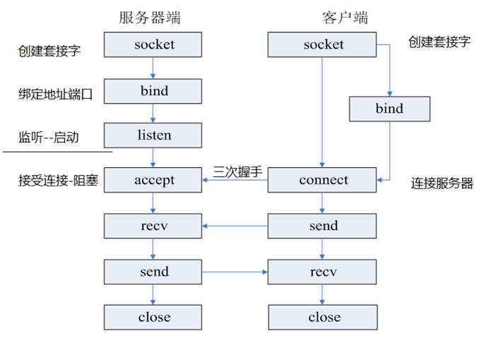
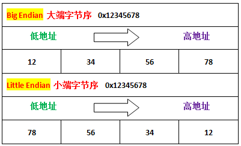

### 套接字实现 TCP 通信流程



```c
/*********************************************************
Copyright © 2022 Shengkai Liu. All rights reserved.
FileName:   client.c
Author:     Shengkai Liu
Date:       2022-05-30
***********************************************************/

#include <sys/socket.h>     // socket, connect
#include <netinet/in.h>     // sockaddr_in, htons
#include <arpa/inet.h>      // inet_pton
#include <unistd.h>         // close
#define SERVER_IP "127.0.0.1"
#define PORT 12345

int main()
{
    // Create a client-side socket.
    int client_sockfd = socket(AF_INET, SOCK_STREAM, 0);
    
    
    // Create and initialize address information, including ip and port.
    struct sockaddr_in addr;
    addr.sin_family = AF_INET;
    inet_pton(AF_INET, SERVER_IP, &addr.sin_addr.s_addr);
    addr.sin_port = htons(PORT);

    // Connect to the server.
    connect(client_sockfd, (struct sockaddr*) &addr, sizeof(addr));


    // communication
    /*..............*/

    // close socket
    close(client_sockfd);
    return 0;
}
```

```c
/*********************************************************
Copyright © 2022 Shengkai Liu. All rights reserved.
FileName:   server.c
Author:     Shengkai Liu
Date:       2022-05-30
***********************************************************/

#include <sys/socket.h>     // socket, bind, listen, socklen_t, accept
#include <netinet/in.h>     // sockaddr_in, htons
#include <arpa/inet.h>      // inet_pton
#include <unistd.h>         // read, write, close
#define SERVER_IP "127.0.0.1"
#define PORT 12345


int main()
{
    // Create a socket for listening.
    int listen_sockfd = socket(AF_INET, SOCK_STREAM, 0);

    // Create and initialize address information, including ip and port.
    struct sockaddr_in listen_addr;
    listen_addr.sin_family = AF_INET;
    inet_pton(AF_INET, SERVER_IP, &listen_addr.sin_addr.s_addr);
    listen_addr.sin_port = htons(PORT);

    // Bind listening sockets to addresses.
    bind(listen_sockfd, (struct sockaddr*) &listen_addr, sizeof(listen_addr));

    // Listening
    listen(listen_sockfd, 5);

    // Accepting client connections, accept is a blocking function.
    struct sockaddr_in client_addr;
    socklen_t len = sizeof(client_addr);
    int server_sockfd = accept(listen_sockfd, (struct sockaddr *)&client_addr, &len);
    
    // Communication
    /*.............*/

    close(server_sockfd);
    close(listen_sockfd);
    return 0;
}
```


### Linux 系统 IO - 文件读写

> 系统调用实现文件拷贝，涉及 open, close, read, write.

```c
/*********************************************************
Copyright © 2022 Shengkai Liu. All rights reserved.
FileName:   copy.c
Author:     Shengkai Liu
Date:       2022-05-30
***********************************************************/

#include <fcntl.h>          // open, O_RDONLY, O_WRONLY, O_CREAT
#include <stdio.h>          // perror
#include <unistd.h>         // close, read, write
#define SRC_FILE_NAME "src.txt"
#define DST_FILE_NAME "dst.txt"

int main()
{
    // open (read)
    int src_fd = open(SRC_FILE_NAME, O_RDONLY);
    if (src_fd == -1) perror("open");

    // open (create and write)
    int dst_fd = open(DST_FILE_NAME, O_WRONLY | O_CREAT, 0664);
    if (dst_fd == -1) perror("open");

    char buf[1024] = {0};
    int len = 0;
    
    // copy from src to dst
    while (len = read(src_fd, buf, sizeof(buf)))
    {
        write(dst_fd, buf, len);
    }

    // close
    close(src_fd);
    close(dst_fd);

    return 0;
}
```


### 字节序 - 如何判断大端小端

> 大端模式：高的有效字节存储在低的存储器地址。网络字节序为大端；
>
> 小端模式：低的有效字节存储在低的存储器地址。
>
> **顺序自然即大端**



判断原理：定义一个大字节的数据 x，判断存放 x 的首地址的数据如何。

>强制类型转换，指针指向首地址
>
>联合体中成员共用一段内存，并且都是从内存首地址开始存

```c
/*********************************************************
Copyright © 2022 Shengkai Liu. All rights reserved.
FileName:   big_endian.c
Author:     Shengkai Liu
Date:       2022-05-30
***********************************************************/

#include <stdio.h>

// method one
void is_big_endian()
{
    printf("方法一\n强制类型转换：\n");

    int a = 0x11223344;
    char b = *(char *)&a;
    
    if (b == 0x11)
    {
        printf("大端模式\n");
    }
    else
    {
        printf("小端模式\n");
    }
    printf("\n");
}

// method two
void is_big_endian1()
{
    printf("方法二\n联合体：\n");
    union u
    {
        int a;
        char b;
    }u;
    u.a = 0x11223344;
    if (u.b == 0x11)
    {
        printf("大端模式\n");
    }
    else
    {
        printf("小端模式\n");
    }
}

int main()
{
    printf("size of int: %ld\n", sizeof(int));
    printf("size of char: %ld\n\n", sizeof(char));
    is_big_endian();
    is_big_endian1();
    return 0;
}
```


### 字节序（网络/主机）转换

> 两种常用的相互转换：
>
> 主机字节序端口 <-----------> 网络字节序端口  （uint16_t   <---------------->  uint16_t）
>
> IPv4字符串  <---------------->  网络字节序IPv4  （const char *  <----------> unsigned int）

```c
/*********************************************************
Copyright © 2022 Shengkai Liu. All rights reserved.
FileName:   byte_conversion.c
Author:     Shengkai Liu
Date:       2022-05-30
***********************************************************/

#include <stdio.h>          // printf
#include <arpa/inet.h>      // htons, ntohs, inet_pton, inet_ntop
#include <assert.h>         // assert
#include <string.h>         // strcmp

#define HOST_PORT 12345
#define IP  "127.0.0.1"

int main()
{
    
    printf("port before conversion: 0x%x \n", HOST_PORT);

    // 1. host to network (unsigned short int)
    uint16_t network_port = htons(HOST_PORT);

    printf("port after conversion: 0x%x\n", network_port);

    // 2. network to host (unsigned short int)
    uint16_t host_port = ntohs(network_port);
    assert(host_port == HOST_PORT);

    
    printf("IPv4 before conversion: %s\n", IP);

    // 3. string of IPv4 to network (unsigned int)
    unsigned int ip_num = 0;
    inet_pton(AF_INET, IP, &ip_num);

    printf("IPv4 after conversion: %d\n", ip_num);

    // 4. network to string of IPv4 (char *)
    char ip_addr[16];
    inet_ntop(AF_INET, &ip_num, ip_addr, sizeof(ip_addr));
    assert(strcmp(IP, ip_addr) == 0);

    return 0;
}
```


### 进程的创建和回收

> fork：创建子进程
>
> - `fork()`会返回两次，在子进程中返回 0， 在父进程中返回子进程的 pid，返回 -1 表示创建失败
> - 创建成功之后，子进程和父进程共享数据（只有pcb中的一些数据不同，如 pid，ppid）。读时共享，写时复制。
>
> 孤儿进程 VS 僵尸进程
>
> - 孤儿进程：父进程结束，子进程运行 --------> 子进程的父进程设置为 `init` (pid = 1) ---------------> 子进程结束时`init` 回收
> - 僵尸进程：子进程结束，父进程运行 ---------> 父进程未结束且未回收子进程（wait）---------------> 僵尸进程  
>
> 子进程回收
>
> - wait：等待任意一个子进程结束，并回收。阻塞等待
> - waitpid：指定一个子进程等待结束并回收，可以设置阻塞和非阻塞


```c
/*********************************************************
Copyright © 2022 Shengkai Liu. All rights reserved.
FileName:   wait.c
Author:     Shengkai Liu
Date:       2022-05-31
***********************************************************/

#include <unistd.h>         // fork, getpid
#include <stdio.h>          // printf, perror
#include <wait.h>           // wait
#include <stdlib.h>         // exit

int main()
{
    // create a sub-process
    pid_t pid = fork();
    
    // prints its own pid if the sub-process
    if (pid == 0)
    {
        printf("pid of the child process: %d\n", getpid());
        exit(0);
    }


    // Recycle sub-process resources by wait
    int status;
    pid = wait(&status);
    if (pid == -1) perror("wait");

    printf("pid of recycled sub-processes: %d\n", pid);

    return 0;
}
```

```c
/*********************************************************
Copyright © 2022 Shengkai Liu. All rights reserved.
FileName:   waitpid.c
Author:     Shengkai Liu
Date:       2022-05-31
***********************************************************/

#include <unistd.h>         // fork, getpid
#include <stdio.h>          // printf, perror
#include <wait.h>           // waitpid
#include <stdlib.h>         // exit

int main()
{
    // create a sub-process
    pid_t pid = fork();
    
    
    if (pid == 0)
    {
        // prints its own pid if the sub-process
        printf("pid of the child process: %d\n", getpid());
        exit(0);
    }
    else if (pid > 0)
    {
        // Recycle sub-process resources by wait
        int status;
        pid = waitpid(pid, &status, 0);
        if (pid == -1) perror("wait");

        printf("pid of recycled sub-processes: %d\n", pid);
        exit(0);
    }
    return -1;
}
```

